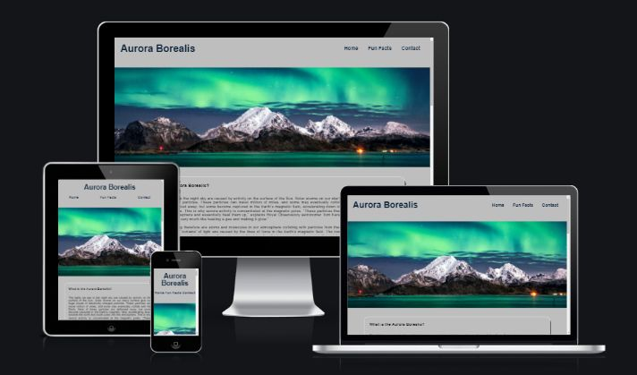
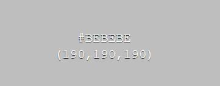
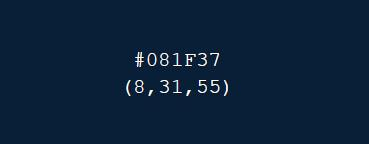

# Aurora Borealis 

<h2 align="center"></h2>

With this site, I wanted to give users who are interested a brief overview of this natural phenomenon. The user will find the scientific explanation of how it arises, some fun facts and a contact page should they wish to get more information about the phenomenon. The live site can be found [here](https://carinaaj.github.io/ms1-aurora-borealis/).

# Design

Text & Background color

Despite the Aurora Borealis being a very visual topic I decided to only implement hero banners as visuals to catch the users interest from the moment they enter the 
site. To soften the contrast but still highlight the colorful hero banners I chose a light grey color as background color. Apart from the logo and navigation menu
the text color is black. As black was a bit too harsh as header I decided to go for a very dark blue color instead.

 

Features

(In this section, you should go over the different parts of your project, and describe each in a sentence or so. You will need to explain what value each of the features provides for the user, focusing on who this website is for, what it is that they want to achieve and how your project is the best way to help them achieve these things.)

Existing Features:

Navigation Bar

To provide the user with an easy navigation across all three pages the header includes the navigation bar at the top right hand corner and the logo ‘Aurora Borealis’ in the top left corner to create some space in between both and make it clear on first sight what the site is about and where the navigation can be found. The navigation bar is made out of the Home, Fun Fact and Contact page. 

The landing page banners

Each page consists of a different hero banner to show the variety of the Aurora and keep the interest of the user rather than using the same image across all pages. In addition it should also intrigue the user to learn more about it and to go through all three pages. 

Landing Page (Home)

This page provides a brief explanation about 1) What the Aurora Borealis is 2) Where the best places are to see it and 3) When the best time is to see it

Whilst the explanations are relatively brief, there is still an indention in each section to make it easier readable. Every question (and answer) has been separated with its own textbox for easy reading and without overwhelming the user by one large paragraph of text. 

After the first question is a short video of 4 min also answering the question ‘What is an aurora’ to provide the user not only with textual content but also with a visual. 

The second section follows the same scheme. First a brief explanation, followed by a Youtube video for some visuals.

The third section, whilst still being one of the most asked questions, when the best time is to see the Northern Lights is a paragraph only without any further visual. However, to make it easy on first glance what the question is about I decided to add a little calendar icon next to the question.

Footer

The footer section features links to four social media sites and upon clicking, a new tab will open.

As the most common colour for the Aurora is green I decided to color pick a light turquoise from the first hero banner and use it as hover color for the social media links with a nice transition duration.

Fun Facts (second page)

Fun Facts

To provide a bit more ‘lighter’ information (as supposed to only being scientific) I decided to add some fun facts about the Aurora on this page. 

Introduction:

This is a test test test 

As this page does not contain any visuals I decided to add some audio instead so the user can listen to some nice and calming music whilst reading about the Aurora. The Track is called ‘Northern Lights’ and has been written for this project.

To follow the same style I separated each fun fact in it’s own textbox and also used indentions where necessary to make it easier to read.

The last textbox makes the user aware that there are live cam links available where the Aurora can be seen from the comfort of their own home. Three links have been provided which all open in a new tab. To keep the same colour scheme the hover colour is the same as the social media links.

Contact (third page)

This page allows the user to leave some details, should he wish to receive a monthly newsletter about the Aurora Borealis. All input fields have a border around which is the same turquoise colour which has been used for the social media links hover. The submit button has also been supplied with the same background colour when hovering over it.

Upon submitting the form the user will be redirected to a new page, which will thank him for signing up and inform him that someone will be in touch within 48 hrs.

—--------> IMPLEMENT THANK YOU PAGE

Future Features

Gallery
A page just for children with child-friendly explanations

Testing

In this section, you need to convince the assessor that you have conducted enough testing to legitimately believe that the site works well. Essentially, in this part you will want to go over all of your project’s features and ensure that they all work as intended, with the project providing an easy and straightforward way for the users to achieve their goals.

In addition, you should mention in this section how your project looks and works on different browsers and screen sizes.

You should also mention in this section any interesting bugs or problems you discovered during your testing, even if you haven't addressed them yet.

If this section grows too long, you may want to split it off into a separate file and link to it from here.

Validator Testing

HTML
No errors were returned when passing through the official W3C validator

CSS
No errors were found when passing through the official (Jigsaw) validator
Unfixed Bugs

You will need to mention unfixed bugs and why they were not fixed. This section should include shortcomings of the frameworks or technologies used. Although time can be a big variable to consider, paucity of time and difficulty understanding implementation is not a valid reason to leave bugs unfixed.

Deployment

The site was deployed to GitHub pages. The steps to deploy are as follows:
In the GitHub repository, navigate to the Settings tab.

On the left-hand side under ‘Code and automation’, select ‘Pages’ and from the 

source section drop-down menu, select the Master Branch.

Once the master branch has been selected, the page will be automatically refreshed with a detailed ribbon display to indicate the successful deployment.
The live link can be found here - 
https://carinaaj.github.io/ms1-aurora-borealis/

Credits
In this section you need to reference where you got your content, media and extra help from. It is common practice to use code from other repositories and tutorials, however, it is important to be very specific about these sources to avoid plagiarism.

You can break the credits section up into Content and Media, depending on what you have included in your project.

Content
The text for the Home page was taken from Wikipedia Article A
Instructions on how to implement form validation on the Sign Up page was taken from Specific YouTube Tutorial
The icons in the footer were taken from Font Awesome

Media

The photos used on the home and sign up page are from This Open Source site
The images used for the gallery page were taken from this other open source site
Congratulations on completing your Readme, you have made another big stride in the direction of being a developer!

