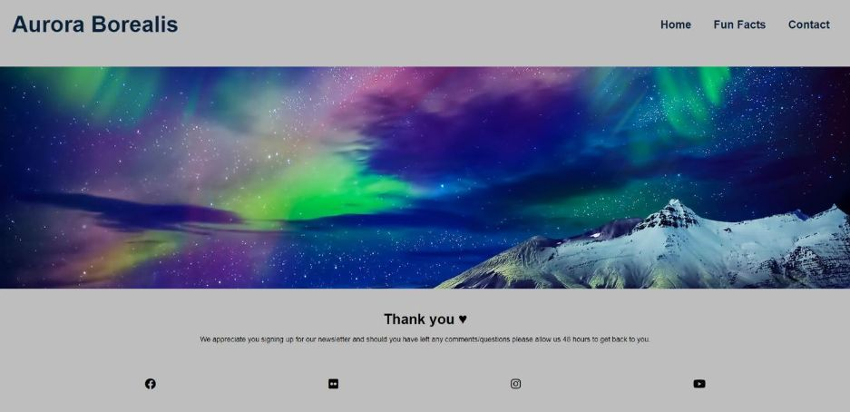
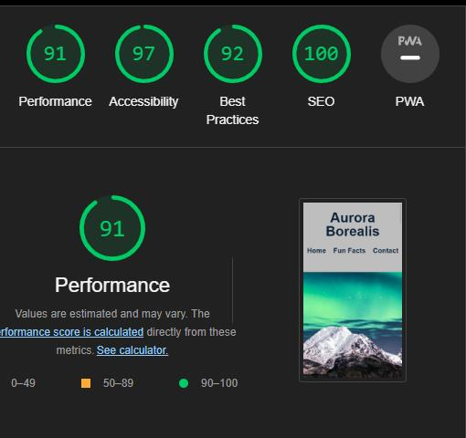

# Aurora Borealis 

With this site, I wanted to give users who are interested a brief overview of this natural phenomenon. The user will find the scientific explanation of how it arises, some fun facts and a contact page should they wish to get more information about the phenomenon. The live site can be found [here](https://carinaaj.github.io/ms1-aurora-borealis/).

# Design

Text & Background color

Despite the Aurora Borealis being a very visual topic I decided to only implement hero banners as visuals to catch the users interest from the moment they enter the 
site. To soften the contrast but still highlight the colorful hero banners I chose a light grey color as background color. Apart from the logo and navigation menu
the text color is black. As black was a bit too harsh as header I decided to go for a very dark blue color instead.

 

Hover/Input Border Color

As the most common colour for the Aurora is green I decided to color pick a light turquoise from the first hero banner and use it as hover color for all links together
with an appropriate transition duration.

This color can also be found as the border around the input fields on the contact page.

# Features

**Existing Features:**

1. Navigation Bar

To provide the user with easy navigation across all three pages, the header includes the navigation bar at the top right hand corner and the logo ‘Aurora Borealis’ in the top left corner, which creates some space in between both, as well as making it clear on first sight what the site is about and where the navigation can be found. The navigation bar is made out of the Home, Fun Fact and Contact page. 

Landing Page aurora banner

Each page consists of a different hero banner to show the variety of the Aurora and keep the interest of the user rather than using the same image across all pages. In addition it should also intrigue the user to learn more about it and to go through all three pages. 

Landing Page (Main Section)

This page provides a brief explanation about 1) What the Aurora Borealis is 2) Where the best places are to see it and 3) When the best time to see it is

Whilst the explanations are relatively brief, there is still a paragraph break in each section to make it easier to read. Every question (and answer) has been separated with its own textbox for easy reading and without overwhelming the user with one large paragraph of text. 

After the first question there is a short Youtube video of 4 min also answering the question ‘What is an aurora’ to provide the user not only with textual content but also with a visual. 

The second section follows the same scheme. First a brief explanation, followed by a Youtube video for some visuals.

Despite being one of the more common questions regarding the Aurora ("When is the best time to see it?"), this section is only a paragraph in length with no supporting YouTube video. However, to make it clearer at first glance what the question is about I decided to add a little calendar icon next to the question, which offers quicker visual context.

4. Footer

The footer section features links to four social media sites and upon clicking, a new tab will open.

---

Fun Facts (second page)

To provide some less scientific and more fun information to the use I decided to add some fun facts about the Aurora on this page. 

**Introduction:**

As this page does not contain any visuals I decided to add some calmin, subject-appropriate music instead, whilst reading more about the Aurora. The Track is called ‘Northern Lights’ and has been written specifically for this project.

To follow the same style in layout as the main page, I separated each fun fact in it’s own textbox and also used paragraph breaks where necessary to make it easier to read.

The last textbox makes the user aware that there are live cam links available where the Aurora can be seen from the comfort of their own home. Three links have been provided which all open in a new tab. To keep the same colour scheme the hover colour is the same as the social media links.

Contact (third page)

This page allows the user to leave some details, should they wish to receive a monthly newsletter about the Aurora Borealis. All input fields have a border around which is the same turquoise colour which has been used for the social media links hover. The submit button has also been supplied with the same background colour when hovering over it.

Upon submitting the form the user will be redirected to a new page, which will thank him for signing up and if he left a comment someone will respond in 48 hrs.

## Future Features

- Gallery page
- Hover effect to reveal fun facts

# Testing

The site has been tested by friends and family on a variety of mobile devices as well as different web browsers (Chrome, Firefox, Safari) and all links, videos, audio and the contact form functioned as it should. In addition I tested it myself extensively with the dev tools to ensure the site works not only on mobile devices as well as medium to larger screens.

One of the biggest problems I encountered from the beginning was aligning my logo together with the navigation menu. I initally looked at the Love Running site for guidance but despite applying the same code it didn't seem to work for my site. After checking with the Slack community and my Mentor I started looking into flexbox as it seems to be the easiest solution. I knew I could have used this across other parts for the website but because I was running out of time I looked only at the basics to make it work for my purposes. 

So after applying display:black to my logo and the navigation bar and giving my logo an appropriate line-height it finally ligned up.

Applying media queries however has been the biggest challenge during this project. 

The first issue I encountered was after applying the first rules to my media queries and I didn't notice that on smaller devices was a horizontal scrollbar. All styles I applied before had to be checked again after this discovery. But before this I had to find out how to eliminate the scrollbar in the first place. The website which provided me with the solution has been credited in the credits section.

One of my main problems after this was to center the Youtube videos and Sound Cloud audio. This took a lot of trial and error. Depending on the device the solution was either changing the width or adjusting the margin.

## Validator Testing

**HTML**
No errors were returned when passing through the official W3C validator

**CSS**
No errors were found when passing through the official (Jigsaw) validator

**Lighthouse**
The page achieved great performance on mobile and desktop

Mobile:

Desktop:

Unfixed Bugs

I would have liked to implement a 'back to top' button as the site contains a lot of text. During my research it seemed that I could have worked around it with the 'a' tag the best solution seems to be javascript which is outside this first module. So I decided to leave it out completely.

Libraries & Programs used:

- Github, to store my repositry
- Gitpod, to create my html and css files
- Google Fonts, for my font family 'Roboto Flex'
- Font Awesome, for my social media icons as well as the calendar icon on the main page and TV screen icon on the fun fact page
- Balsamiq, to create my wireframe
- [Bulk Resize Photos](https://bulkresizephotos.com/en), to compress images
- [NCH Software](https://www.nchsoftware.com/photoeditor/index.html), to edit my hero banners
- Am I Responsive?, to esnure the site looked good across different devices

Deployment

The site was deployed to GitHub pages. The steps to deploy are as follows:
In the GitHub repository, navigate to the Settings tab.

On the left-hand side under ‘Code and automation’, select ‘Pages’ and from the source section drop-down menu, select the Master Branch.

Once the master branch has been selected, the page will be automatically refreshed with a detailed ribbon display to indicate the successful deployment.
The live link can be found here - 
https://carinaaj.github.io/ms1-aurora-borealis/

# Credits
In this section you need to reference where you got your content, media and extra help from. It is common practice to use code from other repositories and tutorials, however, it is important to be very specific about these sources to avoid plagiarism.

You can break the credits section up into Content and Media, depending on what you have included in your project.

Content
The text for the Home page was taken from Wikipedia Article A
Instructions on how to implement form validation on the Sign Up page was taken from Specific YouTube Tutorial
The icons in the footer were taken from Font Awesome

## Media

All hero banners have been taken from Shutterstuck:

- First hero banner (Stock Photo ID: 1291999282), Photo Contributor: [Therato](https://www.shutterstock.com/g/Therato)
- Second hero banner (Stock Photo ID: 604599662), Photo Contributor: [Weston](https://www.shutterstock.com/g/Weston)
- Third hero banner (Stock Photo ID: 771042802), Photo Contributor: [muratart](https://www.shutterstock.com/g/muratart)
- Fourth hero banner (Stock Photo ID: 1319416262), Photo Contributor: [Krivosheev Vitaly](https://www.shutterstock.com/g/dary)

